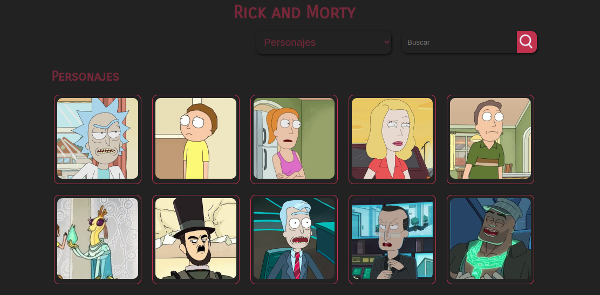
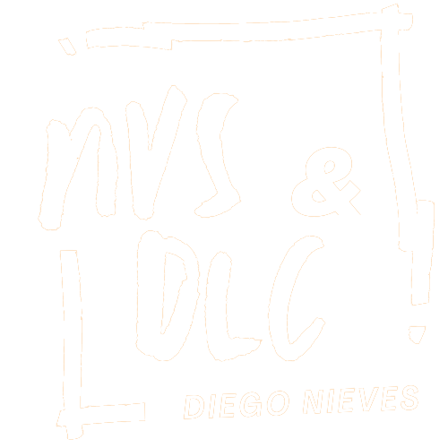

# Rick and Morty App

    

 

## Decripcion

Cree un sitio donde el usuario pueda ver información sobre las ubicaciones de los universos y personajes de “Rick and Morty”.

Utilizando la API de [The Rick and Morty API](https://rickandmortyapi.com/) para obtener la información nesesaria. Creando asi una app web que muestra los diferentes personajes y universos, con su respectiva informacion

## Funciones y datos del proyecto

- Correcto despliegue de información de la ubicación: Nombre, tipo, dimensión, cantidad de residentes.
- Correcto despliegue de información de los personajes: Nombre, estado, image, origen, dimensión, cantidad de episodios.
- Correcto funcionamiento del buscador (buscador por nombre).
- Listado de informacion de residentes y ubicaciones paginados.

## Utilice

- React
- Axios
- Html
- Css
- Framer-Motion
- Redux-toolkit
- React-loading-skeleton

## Autor
** Diego Nieves **
* [LinkedIn](https://www.linkedin.com/in/diego-nieves-04b409242/)
* [Portafolio web](https://nvs-portfolio.netlify.app)

## Abrir App
- [Rick and Morty App](https://subtle-banoffee-4014e9.netlify.app/)

## Contactame
Si quieres contactarme puedes escribirme a nieves.diego0426@gmail.com 👍.

  

    

